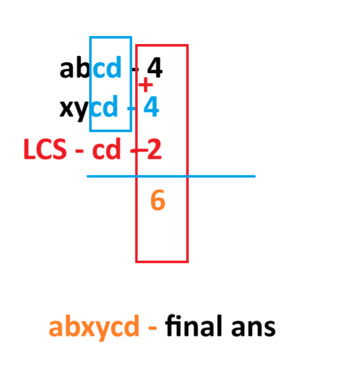

# [Shoretest Common SuperSubsequence](https://leetcode.com/problems/shortest-common-supersequence/description/)

## Intution:



<!--  -->

```
class Solution
{
    public:
    //Function to find length of shortest common supersequence of two strings.
    int shortestCommonSupersequence(string str1, string str2, int n, int m)
    {
        
        int dp[n+1][m+1];


        for(int i=0;i<=n;i++)
            dp[i][0] = 0;
        
        for(int j=0;j<=m;j++)
            dp[0][j] = 0;
            

        for(int i=1;i<=n;i++)
        {
            for(int j=1;j<=m;j++)
            {
                if(str1[i-1] == str2[j-1])
                {
                    dp[i][j] = 1 + dp[i-1][j-1];
                }
                else
                {
                    dp[i][j] = max(dp[i][j-1] , dp[i-1][j]);
                }
            }
        }

        //ABOVE CODE OF TRADITIONAL LCS

        return n+m-dp[n][m]; // MAIN CHANGE 
    }
};
```


